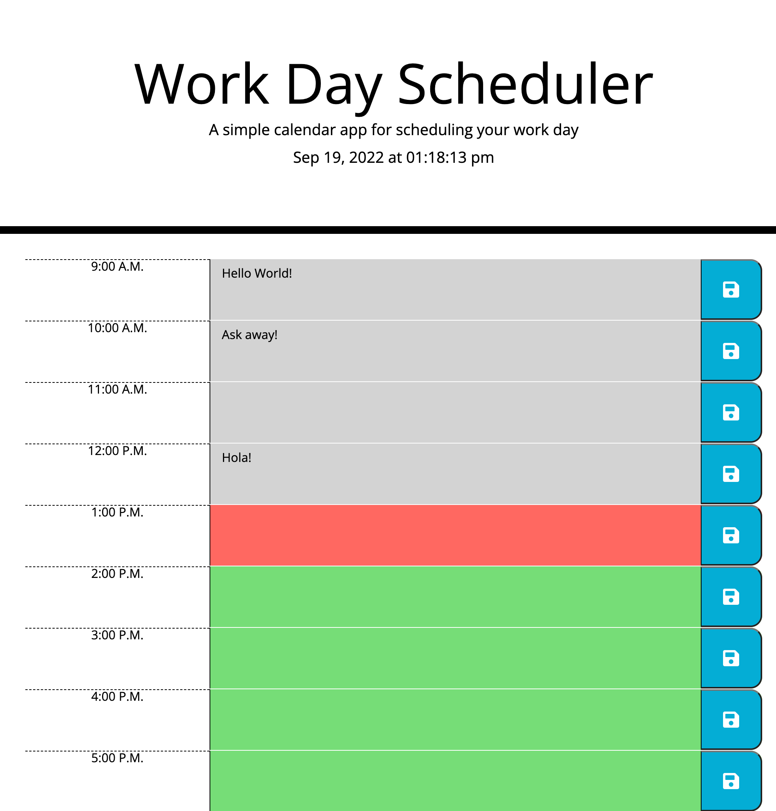

# Daily Planner Application

## Description

This website is created and designed to be a planner. It shows normal business hours of a given day with a corresponding field where the user can input their daily activities. In the header, we have a live time, precise to the second. Each hour field has a save button associated with it, and each value field works in conjunction with the live time to visually show the user whether each hour in the day has already passed. The application also utilizes local storage to save the users' input and have it be available even after the page has been reloaded.

## Installation

N/A

## Usage

This website's usage is to help any user be able to plan their daily activities, and use the live time feature to see how the day has progressed.

## Links

Below is the link to the deployed website:
https://mmuugii.github.io/Daily-Planner/

## Screenshot of Website

## Credits

N/A

## License

N/A.
